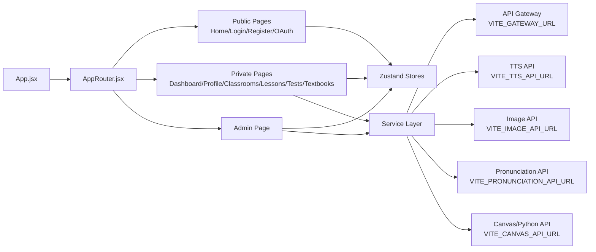

<a id="readme-top"></a>

<div align="center">

# Hệ Thống Hỗ Trợ Giáo Viên Tiểu Học Tạo Bài Giảng Tích Hợp AI

Frontend React/Vite cho nền tảng hỗ trợ giáo viên tiểu học: quản lý lớp học, bài giảng, đề kiểm tra, sách giáo khoa và các công cụ AI/media phục vụ dạy học.

<p>
  
  
  
  
  
</p>

<p>
  <a href="#tong-quan">Tổng quan</a>
  ·
  <a href="#diem-noi-bat">Điểm nổi bật</a>
  ·
  <a href="#kien-truc-frontend">Kiến trúc</a>
  ·
  <a href="#tinh-nang-chinh">Tính năng</a>
  ·
  <a href="#chay-local">Chạy local</a>
</p>

### Nhóm thực hiện

| Họ và tên | Mã số sinh viên |
| :--- | :---: |
| **Nguyễn Quốc Tấn** | `22130248` |
| **Đặng Anh Nguyên** | `22130188` |

</div>

---

## Tổng quan

`PrimarySchoolTeacherSupportSystemFrontEnd` là giao diện người dùng của hệ thống hỗ trợ giáo viên tiểu học. Dự án được xây dựng bằng React 19 và Vite, sử dụng React Router cho điều hướng, Zustand cho state management, Tailwind CSS cho styling, Axios/fetch cho API client và nhiều thư viện xử lý tài liệu, canvas, audio, hình ảnh.

Frontend kết nối với backend microservices thông qua API Gateway, đồng thời gọi một số service media/AI như Image API, TTS API, Pronunciation API và Canvas/Python API tùy tính năng.

<p align="right"><a href="#readme-top">Lên đầu trang</a></p>

## Điểm nổi bật

### Trải nghiệm sản phẩm hoàn chỉnh

- Có đầy đủ luồng public/private route: trang chủ, đăng nhập, đăng ký, OAuth2 callback, dashboard, hồ sơ, admin, lớp học, bài giảng, kiểm tra và sách giáo khoa.
- Phân quyền route theo vai trò từ `authStore`: học sinh/giáo viên dùng dashboard, admin dùng trang quản trị.
- Giao diện chia theo domain rõ ràng, dễ phát triển tiếp từng mảng chức năng.

### Bộ công cụ dạy học phong phú

- Quản lý bài giảng, template, draft và chia sẻ bài giảng.
- Editor DOCX/PPTX custom dựa trên canvas/Fabric và các utility riêng.
- Tích hợp Collabora Editor cho chỉnh sửa tài liệu qua backend WOPI.
- Quản lý đề kiểm tra, tạo/sửa đề, làm bài, lịch sử lượt làm và xuất DOCX.
- Đọc sách giáo khoa với reader và thumbnails.

### Tích hợp AI/media

- TTS: chuyển văn bản thành giọng nói, lưu và quản lý audio.
- Pronunciation: upload/ghi âm để kiểm tra phát âm theo văn bản mục tiêu.
- AI Image/Image: tạo ảnh minh họa, lưu ảnh và dùng lại trong thư viện.
- Illustration Studio, canvas tools, color picker, shape library phục vụ thiết kế nội dung bài giảng.

### Nền tảng kỹ thuật hiện đại

- React 19, Vite 7, Tailwind CSS 4.
- Zustand cho state global gọn nhẹ.
- React Router DOM 7 cho routing.
- Axios/fetch service layer tách riêng theo domain.
- CKEditor, Fabric, docx, pptxgenjs, jsPDF, html2canvas, file-saver hỗ trợ biên soạn và xuất tài liệu.

<p align="right"><a href="#readme-top">Lên đầu trang</a></p>

## Kiến trúc frontend



<p align="right"><a href="#readme-top">Lên đầu trang</a></p>

## Tính năng chính

| Nhóm | Màn hình/module | Vai trò |
| --- | --- | --- |
| Public | `HomePage`, `LoginPage`, `RegisterPage`, `OAuth2CallbackPage` | Trang giới thiệu, đăng nhập, đăng ký, xử lý đăng nhập Google OAuth2. |
| Dashboard | `DashboardPage` | Không gian sau đăng nhập cho người dùng thường. |
| Hồ sơ | `ProfilePage` | Cập nhật thông tin cá nhân, trường học/lớp, avatar, đổi mật khẩu. |
| Admin | `AdminPage` | Quản trị người dùng, danh mục, lớp học, bài giảng, đề kiểm tra, tài nguyên và nội dung bài học. |
| Lớp học | `ClassroomsPage`, `ClassroomDetail`, `JoinClassroom` | Tạo/quản lý lớp, tham gia lớp, lời mời, thành viên, bài đăng, bài giảng trong lớp. |
| Bài giảng | `LessonsPage`, `DocxEditorPage`, `PptxEditorPage`, `CollaboraEditorPage` | Quản lý draft/template, soạn tài liệu, chỉnh sửa slide/tài liệu, chia sẻ bài giảng. |
| Kiểm tra | `TestsPage`, `CreateTestPage` | Tạo đề, sửa đề, làm bài, nộp bài, tải DOCX. |
| Sách giáo khoa | `TextbooksPage`, `TextbookReaderPage` | Xem danh sách sách và đọc trang sách. |
| AI/media | `TTSPage`, `PronunciationPage`, `AIImagePage`, `ImagePage`, `AIToolsPage` | Chuyển văn bản thành giọng nói, kiểm tra phát âm, tạo ảnh, quản lý công cụ AI. |

## Route chính

| Path | Quyền truy cập theo source |
| --- | --- |
| `/` | Public nếu chưa đăng nhập. |
| `/login`, `/register` | Public nếu chưa đăng nhập. |
| `/oauth2/callback` | Public callback. |
| `/dashboard` | Đăng nhập, role `1` hoặc `2`. |
| `/profile` | Đăng nhập, role `1` hoặc `2`. |
| `/admin` | Đăng nhập, role `3`. |
| `/classrooms`, `/classrooms/:id` | Đăng nhập, role `1` hoặc `2`. |
| `/lessons` | Đăng nhập, role `2`. |
| `/lessons/docx-editor`, `/lessons/pptx-editor`, `/lessons/collabora-editor` | Đăng nhập, role `1` hoặc `2`. |
| `/tests`, `/tests/create`, `/tests/:id/edit` | Đăng nhập, role `2`. |
| `/textbooks`, `/textbooks/:slugId` | Đăng nhập, role `1` hoặc `2`. |
| `/tts`, `/ai-image`, `/pronunciation` | Đăng nhập, role `1` hoặc `2`. |
| `/image` | Public theo route hiện tại. |
| `/join/link`, `/join/invitation` | Public theo route hiện tại. |

<p align="right"><a href="#readme-top">Lên đầu trang</a></p>

## Tech stack

| Nhóm | Công nghệ |
| --- | --- |
| Core | React 19, React DOM 19, Vite 7 |
| Styling | Tailwind CSS 4, CSS modules/files theo view |
| Routing | React Router DOM 7 |
| State | Zustand |
| API Client | Axios, Fetch API |
| Icons/UI | Lucide React, React Icons |
| Editor/Canvas | Fabric, CKEditor 5, custom canvas utilities |
| Export tài liệu | docx, pptxgenjs, jsPDF, html2canvas, file-saver |
| Table/Data | TanStack React Table |
| Media/UX | page-flip, react-colorful, fontfaceobserver |
| Lint | ESLint 9, eslint-plugin-react-hooks, eslint-plugin-react-refresh |

## Cấu trúc thư mục

```text
.
+-- public/                         # Static assets public
+-- src/
|   +-- assets/                     # Ảnh, SVG, tài nguyên UI
|   +-- common/                     # Component dùng chung: modal, color picker, AI image, table tools
|   +-- components/                 # Navbar, footer, sidebar, layout, shared components
|   +-- config/                     # Cấu hình API
|   +-- data/                       # Mock/static data và constants
|   +-- helpers/                    # Helper cho image, date, loader
|   +-- hooks/                      # Custom hooks
|   +-- routers/                    # AppRouter và route guards
|   +-- services/                   # API clients theo domain
|   +-- stores/                     # Zustand stores
|   +-- utils/                      # Fabric/canvas/table/font utilities
|   +-- views/                      # Các page chính của ứng dụng
+-- .env.example                    # Mẫu biến môi trường frontend
+-- index.html
+-- package.json
+-- vite.config.js
+```

## Cấu hình môi trường

Tạo file `.env.local` từ file mẫu:

```powershell
Copy-Item .env.example .env.local
```

Các biến đang được source sử dụng:

| Biến | Mặc định/mục đích |
| --- | --- |
| `VITE_GATEWAY_URL` | API Gateway backend, mặc định trong source là `http://localhost:8080`. |
| `VITE_CANVAS_API_URL` | Canvas/Python API, mặc định mẫu là `http://localhost:8001`. |
| `VITE_IMAGE_API_URL` | Image service, mặc định mẫu là `http://localhost:8083`. |
| `VITE_TTS_API_URL` | TTS API, mẫu đi qua gateway `http://localhost:8080/api/tts`. |
| `VITE_PRONUNCIATION_API_URL` | Pronunciation API qua gateway `http://localhost:8080/api/pronunciation`. |

## Chạy local

### Yêu cầu

- Node.js phù hợp với Vite 7.
- npm.
- Backend/API Gateway chạy ở `http://localhost:8080` nếu dùng đầy đủ tính năng.
- Các service phụ trợ như Canvas/Python API, Image API, TTS API, Pronunciation API nếu dùng tính năng tương ứng.

### Cài dependencies

```powershell
npm install
```

### Chạy dev server

```powershell
npm run dev
```

Vite được cấu hình chạy tại:

```text
http://localhost:5173
```

### Build production

```powershell
npm run build
```

### Preview bản build

```powershell
npm run preview
```

### Lint

```powershell
npm run lint
```

<p align="right"><a href="#readme-top">Lên đầu trang</a></p>

## Scripts

| Script | Mục đích |
| --- | --- |
| `npm run dev` | Chạy Vite dev server. |
| `npm run build` | Build production vào `dist/`. |
| `npm run preview` | Preview bản build production. |
| `npm run lint` | Kiểm tra lint bằng ESLint. |

## Kết nối backend

Frontend được thiết kế để làm việc với backend microservices qua API Gateway:

```text
Frontend :5173 -> API Gateway :8080 -> Backend services
```

Một số service có URL cấu hình riêng qua biến môi trường để thuận tiện phát triển local:

- TTS service.
- Image service.
- Pronunciation service.
- Canvas/Python API.

## Giá trị kỹ thuật

| Giá trị | Ý nghĩa |
| --- | --- |
| Tách domain rõ | Mỗi nhóm màn hình/API có thư mục riêng, dễ bảo trì. |
| Dễ mở rộng | Có service layer, stores và router độc lập theo domain. |
| Hỗ trợ sản phẩm thật | Bao phủ cả học sinh, giáo viên, admin và nhiều nghiệp vụ giáo dục. |
| Nhiều công cụ sáng tạo | Có editor, canvas, export tài liệu, AI image, TTS, pronunciation. |
| Phù hợp demo và phát triển tiếp | Chạy nhanh bằng Vite, build gọn, dễ kết nối backend local. |

## Ghi chú phát triển

- Không commit `.env`, `.env.local` hoặc secret thật.
- Khi thêm API mới, nên đặt trong `src/services/` và dùng `src/config/api.config.js` nếu cần base URL.
- Khi thêm route mới, cập nhật `src/routers/AppRouter.jsx` và kiểm tra role phù hợp.
- Khi thêm state global, ưu tiên đặt trong `src/stores/` theo pattern Zustand hiện tại.
- Không chỉnh trực tiếp `dist/` hoặc `node_modules/`.

---

<div align="center">

Frontend for **Hệ Thống Hỗ Trợ Giáo Viên Tiểu Học Tạo Bài Giảng Tích Hợp AI**

</div>
